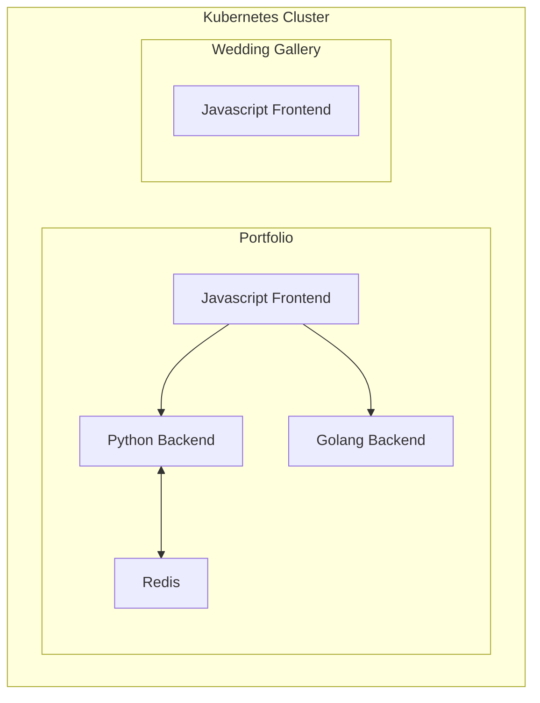

# Cluster Configs

This repo contains configurations for Kubernetes clusters.

## NDSquared Cluster

**Applications**:

- [Portfolio](https://www.ndsquared.net)
  - [Python Backend](https://api.ndsquared.net/docs)
  - [Golang Backend](https://goapi.ndsquared.net/docs)
- [Wedding Gallery](https://wedding.ndsquared.net)

### Architecture

The following is a brief diagram of the application components:



## Local Development

Local development leverages [K3D](https://k3d.io/) to create a local Kubernetes cluster. 

[Kubectl](https://kubernetes.io/docs/tasks/tools/) and [FluxCLI](https://fluxcd.io/docs/installation/#install-the-flux-cli) are used to bootstrap the cluster. 

The built-in [Traefik](https://doc.traefik.io/traefik/) ingress controller is used to proxy the application endpoints.

URL endpoints:
- [Portfolio](http://localhost:8000)
  - [Python Backend](http://pyapi.localhost:8000/docs)
  - [Golang Backend](http://goapi.localhost:8000/docs)
- [Wedding Gallery](http://wedding.localhost:8000)

### Requirements

- [ASDF-VM](https://asdf-vm.com/)
- [Docker](https://www.docker.com/)

### Usage

Run `make create` to create the local Kubernetes cluster and bootstrap Flux.

### Make Targets

```
help                           View help information
asdf-bootstrap                 Install all tools through asdf-vm
flux-bootstrap                 Install flux and bootstrap local overlay
bootstrap                      Perform all bootstrapping required for local development
create                         Create local development environment
clean                          Destroy local development environment
create-gitlab-secret           Create a gitlab secret to be used with the external secrets store
apply-gitlab-secret            Apply a gitlab secret to be used with the external secrets store
```
